# Documentation Overview

This repository is used to preprocess and analyse AXONA electrophysiology and TRUSCAN position data in a trace fear conditioning paradigm.

The functions and scripts is organized into folders for structure (e.g. `axona_io`) and can be included to the path in the relevant scripts (e.g. `addpath('axona_io')`). In the parent-folder, there are several `demo_*.m` scripts which showcase how the individual functions should be used to achieve specific goals (e.g. `demo_eeg.m` shows how to plot simple info on the local field potential data and calculate the power spectrum and a wavelet-based time-frequency analysis).

